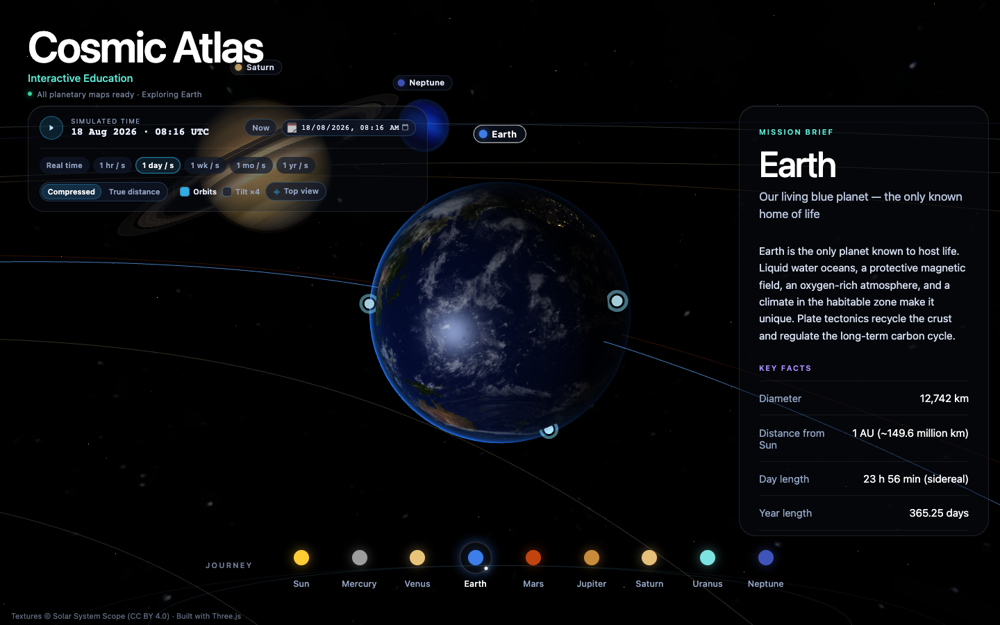

# Cosmic Atlas

Cosmic Atlas is an interactive Three.js solar-system explorer: start at Earth, fly to the Sun and every major planet, and learn through researched facts and clickable hotspots.



## What is inside

- The Sun plus Mercury, Venus, Earth, Mars, Jupiter, Saturn (with rings), Uranus, and Neptune, each with real Solar System Scope maps.
- An Earth-first camera and learning panel so the first thing you see is home.
- A journey rail that flies the camera along a GSAP arc — swoop out, then in — instead of a hard cut.
- A mission-brief panel: overview, key facts, composition, and notable features for every body.
- Three to four clickable hotspots per body, both on the globe and in the panel.
- Earth day/night blending, clouds, and a normal/specular stack; fresnel atmospheres; a galaxy starfield.
- A cinematic launch intro on first load, with a skip path and a reduced-motion path.
- Simulated time so orbits and rotations keep moving while you explore.

## How it is made

The page is a Vite + TypeScript app. [`index.html`](index.html) boots [`src/main.ts`](src/main.ts), which owns the simulated clock and wires three layers:

- **`src/data/`** — the body catalog and educational copy. No DOM, no WebGL.
- **`src/scene/`** — Three.js renderer, textures, Keplerian positions, materials, and camera travel.
- **`src/ui/`** — the learning panel, journey selector, and time dock.

Camera travel is a GSAP 0→1 clock sampled along a computed arc. Planetary maps are shipped as WebP/JPEG tiers under `public/textures/` (`lo/` for the intro and phones, `mid/` for most laptops, native maps as the ceiling). The original multi-hundred-MB Solar System Scope archives stay gitignored; they are re-downloadable from the source.

A deeper map of the runtime is in [`docs/architecture.md`](docs/architecture.md). Orbital math is specified in [`docs/orbital-mechanics-spec.md`](docs/orbital-mechanics-spec.md).

## Run locally

```bash
npm install
npm run dev
```

Open the local URL Vite prints (typically `http://localhost:5173`). Serve over HTTP — opening `index.html` as `file://` will fail because the app is an ES module.

```bash
npm test          # unit tests against the shipped modules
npm run build     # production build → dist/
npm run preview   # serve dist/
```

A browser with WebGL is required for the 3D view.

## Project structure

```text
cosmic-atlas/
├── index.html                  # Vite entry
├── package.json                # app scripts (this is not an npm library)
├── LICENSE                     # MIT — original project code only
├── README.md
├── assets/                     # README preview
├── licenses/                   # third-party license texts
│   ├── NOTICE.md
│   ├── CC-BY-4.0.txt
│   ├── THREE-LICENSE.txt
│   └── GSAP-STANDARD-LICENSE.txt
├── docs/
│   ├── architecture.md
│   └── orbital-mechanics-spec.md
├── public/
│   ├── favicon.png
│   ├── apple-touch-icon.png
│   ├── brand-mark.png
│   └── textures/               # shipped maps (lo/, mid/, native)
├── scripts/                    # texture tiers + launch/orbit checks
└── src/
    ├── main.ts                 # boot, clock, travel ↔ scene ↔ UI
    ├── style.css
    ├── data/                   # catalog + educational content
    ├── state/                  # travel FSM + simulated time
    ├── scene/                  # Three.js scene, orbits, materials
    ├── intro/                  # cinematic launch sequence
    └── ui/                     # learning panel, journey rail, time dock
```

## Design and attribution

Interaction and production-asset patterns come from educational 3D explorers (anatomy / historical-atlas style): a polished HUD, on-demand maps, and inspect-to-learn hotspots. The educational copy and scene are original. This project is not affiliated with those inspirations.

Planetary textures are from [Solar System Scope](https://www.solarsystemscope.com/textures/) and remain under [CC BY 4.0](licenses/CC-BY-4.0.txt). Rendering uses [three.js](https://threejs.org/) (MIT) and camera motion uses [GSAP](https://gsap.com/) (Standard “no charge” license). Those works stay under their own terms — the project MIT license does not relicense them. Full texts and a rights map are in [`licenses/`](licenses/).

Original Cosmic Atlas source code is licensed under the [MIT License](LICENSE).
